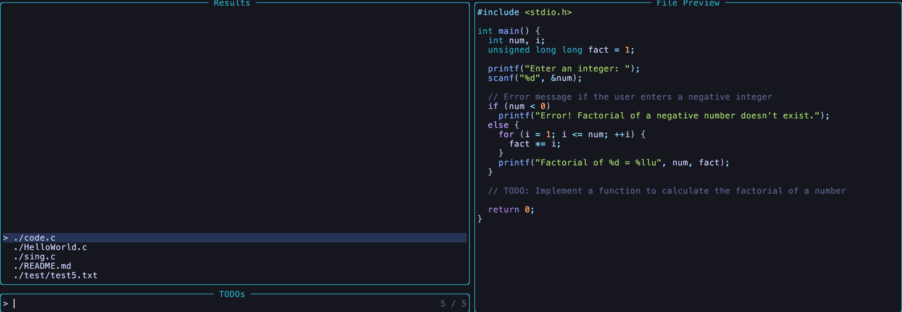

# todofinder.nvim

## What is TodoFinder ?

<code>TodoFinder</code> is a tool to easily view everywhere you have write some todo in your code using Telescope features.



## Installation

You can install the plugin with your preffered package manager:

### [lazy.nvim](https://github.com/folke/lazy.nvim)

```lua
	{
		'MaxLabrecque/todofinder.nvim',
		dependencies = { 'nvim-telescope/telescope.nvim' }
	},
```

## 🚀 Usage
Only need to enter the command and it do everything else.
```
:TodoFinder
```
